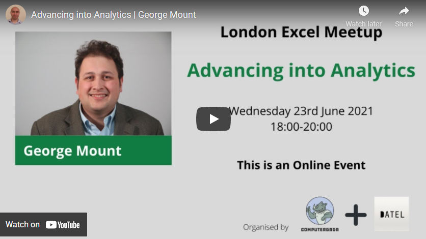

# _Advancing into Analytics_ Presentation to the London Excel Meetup

This presentation has concluded. Click through the following image to view the recording:

**Run in RStudio:** 

**Run in Jupyter:** 

## Want more? [Check out my book, _Advancing into Analytics: From Excel to Python and R_ (O'Reilly)](http://georgejmount.com/book/)

